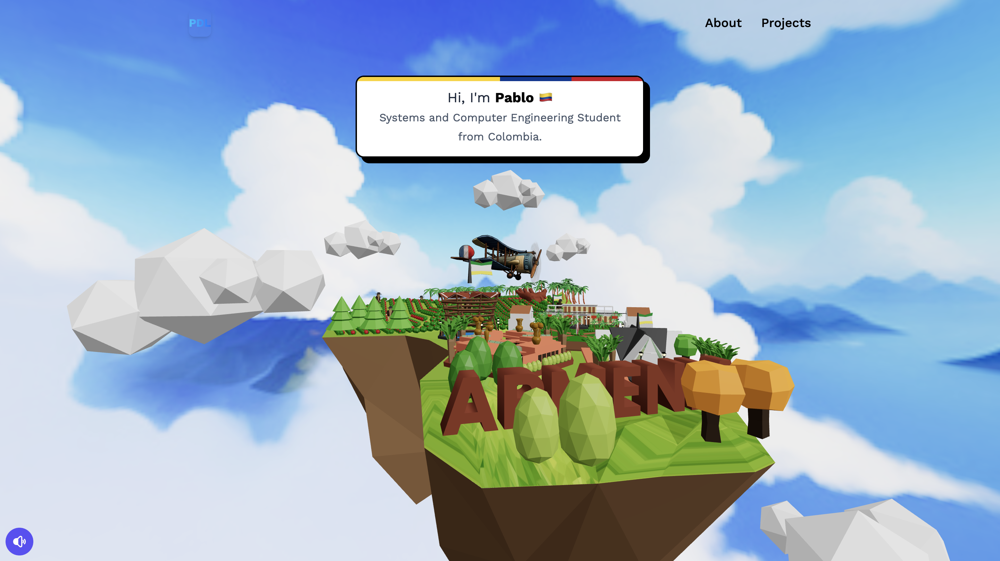
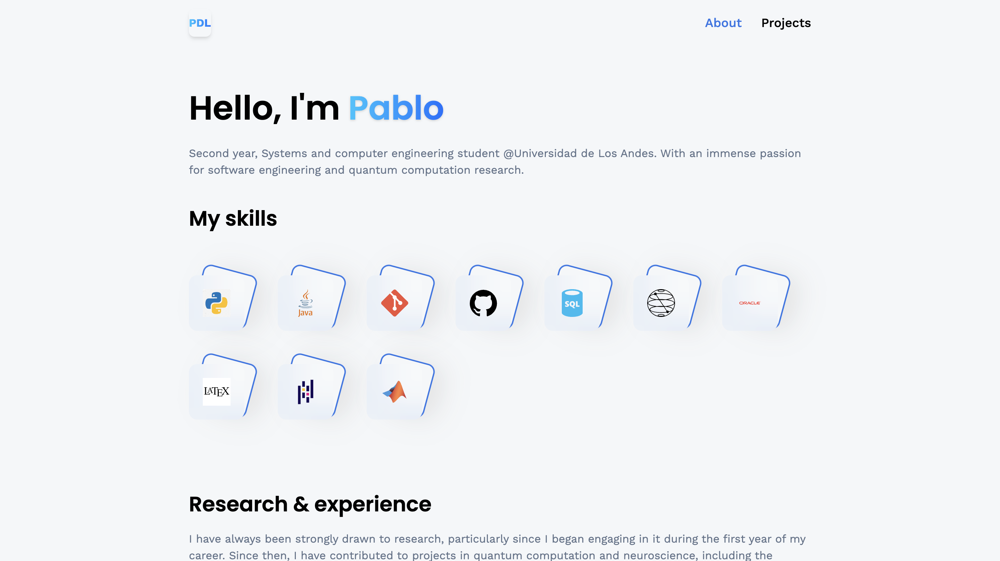
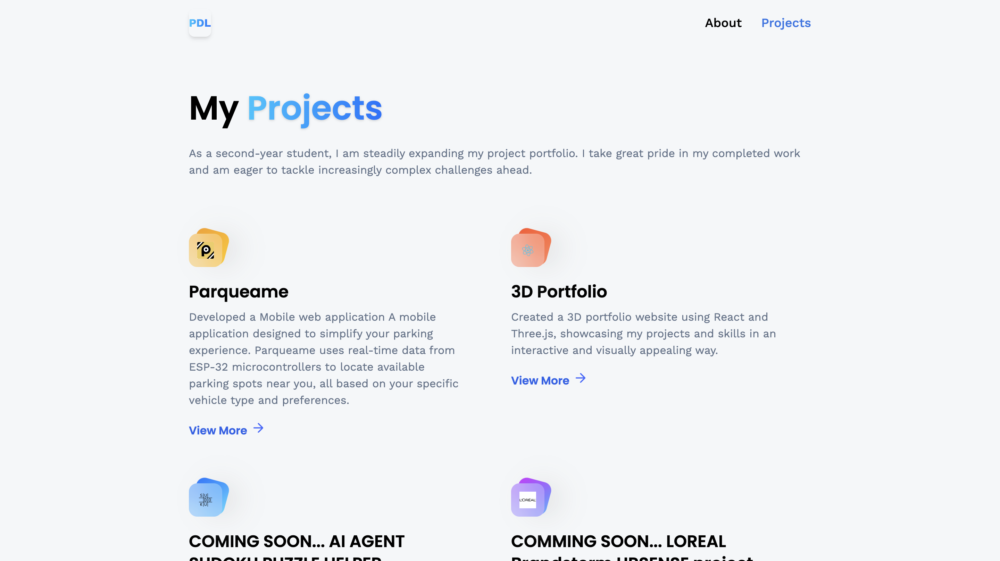
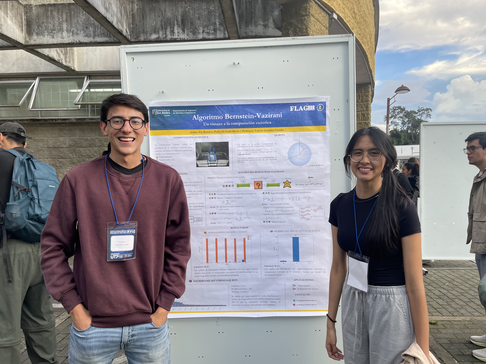

# 🌌 3D Interactive Portfolio | Pablo De León

<div align="center">
  <a href="https://pablodeleon3dportfolio.com/">
    
  </a>
</div>

An immersive, three-dimensional web experience that serves as a digital gateway to my professional and academic journey. Built with **React** and **Three.js**, this portfolio replaces static 2D elements with a navigable, low-poly world to showcase software engineering skills and quantum computing research.

---

## 🌐 Live Experience
> **Important:** Experience the full interactive 3D world, including the "Parqueame" project and my research journey, live at:
> ### 🔗 [pablodeleon3dportfolio.com](https://pablodeleon3dportfolio.com)

---

## 🖼️ Visual Gallery

| **The Central Hub** | **Skills & Research** |
| :---: | :---: |
|  |  |
| *A low-poly floating island featuring interactive landmarks and smooth 3D navigation.* | *Clean, card-based interface detailing technical proficiencies and academic focus.* |

---

## 🚀 Core Features

* **Interactive 3D Navigation:** A fully rendered environment where users can explore different "islands" of information using **React Three Fiber**.
* **Project Showcase:** A dedicated portal highlighting key works, including the **Parqueame** smart parking app.
* **Dynamic Skill Matrix:** Visual representation of expertise in Python, Java, SQL, Git, and specialized tools like LaTeX and MATLAB.
* **Academic Integration:** Direct insights into research conducted at **Universidad de los Andes**, specifically in software engineering and quantum computation.

---

## 🛠️ Technical Stack

* **Framework:** React
* **3D Engine:** Three.js / React Three Fiber
* **UI/UX:** Responsive design with a focus on glassmorphism and high-readability typography
* **Hosting:** Optimized for web performance and seamless asset loading

---

## 📂 Project Management

<div align="center">
  
  <p><em>The bridge between 3D exploration and detailed project documentation.</em></p>
</div>

---

## 📖 About the Developer
My name is Pablo De León,




I am a second-year **Systems and Computer Engineering student** at **Universidad de los Andes**. My work sits at the intersection of robust software architecture and experimental research in quantum computing.

If you have a project in mind, or just want to reach out, here are my socials:

* **LinkedIn:** [pablodeleonn](https://www.linkedin.com/in/pablodeleonn)
* **GitHub:** [deleonpablo](https://github.com/deleonpablo)
* **Email:** [pdelion.wws@gmail.com](mailto:pdelion.wws@gmail.com)
* **Live Portfolio:** [pablodeleon3dportfolio.com](https://pablodeleon3dportfolio.com/projects)

### 💻 Local Installation

1. **Clone the repository:**
   ```bash
   git clone [https://github.com/your-username/3d-portfolio.git](https://github.com/your-username/3d-portfolio.git)
